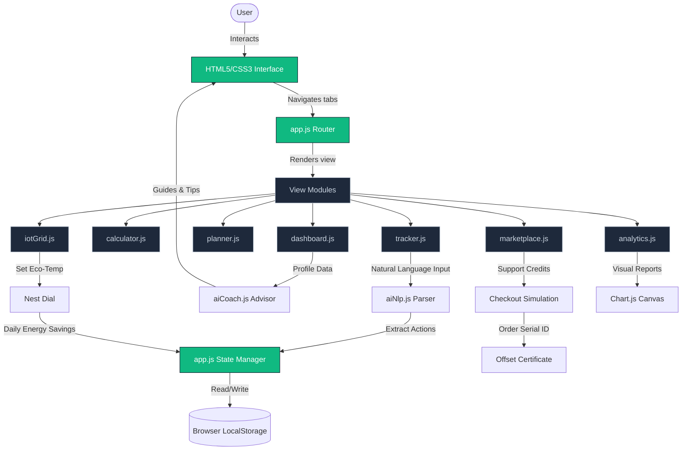

# 🌍 Terrasense — Carbon Footprint Platform

[](https://terrasense-mquwiikjcq-uc.a.run.app)
[](https://opensource.org/licenses/MIT)
[](https://developer.mozilla.org/en-US/docs/Web/JavaScript)
[](https://nginx.org)

**Terrasense** is a premium, high-fidelity web application built to allow individuals to track, calculate, and systematically offset their daily environmental footprint. Designed with glassmorphic aesthetics, fluid animations, and real-time interactive dashboards, Terrasense couples IoT utility simulators with AI-driven natural language activity logging.

---

## 🚀 Key Features

*   **Wizard Carbon Calculator**: A 4-step questionnaire (Transport, Utility Energy, Diet, Shopping) estimating baseline carbon outputs.
*   **Live Dashboard**: High-fidelity gauge analytics comparing user metrics to national averages and Paris Agreement targets. Includes streak trackers and badges.
*   **AI Natural Language Logger**: Submit logs in plain English (e.g. *"I commuted 10 km by train and had a vegan lunch"*) to dynamically compute offsets.
*   **TerraAI Chatbot Assistant**: Embedded context-aware conversational advisor using local emissions to provide custom conservation tips.
*   **Smart Nest/IoT Grid Simulator**: Circular smart thermostat dial showing live renewable/fossil grid intensity stats to schedule energy usage.
*   **Gold Standard Offset Marketplace**: Project registry, animated checkout simulation, and generated/printable Carbon Offset Certificates.
*   **Pro Eco Auditing**: Evaluates metrics to compile detailed printable sustainability report cards with carbon letter grades (A-F).
*   **Dynamic Analytics**: Visual doughnuts and weekly reduction trends powered by Chart.js.

---

## 📊 System Architecture



---

## 🛠️ Getting Started

### Prerequisites
*   Python 3 (to serve locally)
*   Docker (optional, for local container runs)

### 1. Run Locally
Serve the application locally using Python's static HTTP server:
```bash
python3 -m http.server 8000
```
Open your browser and navigate to `http://localhost:8000`.

### 2. Run with Docker
Compile and run the container locally:
```bash
# Build the container image
docker build -t terrasense .

# Run the container (maps Nginx port 8888 locally)
docker run -d -p 8888:8080 terrasense
```
Visit `http://localhost:8888`.

### 3. Deploy to Cloud Run
Deploy directly via Google Cloud Build (does not require local Docker daemon):
```bash
gcloud run deploy terrasense --source . --region us-central1 --allow-unauthenticated
```

---

## 📁 Repository Structure

```
.
├── components/
│   ├── aiChatTab.js     # Full-screen chatbot dashboard view
│   ├── aiCoach.js       # Conversation prompt response manager
│   ├── aiNlp.js         # Semantic keyword parsing regex module
│   ├── analytics.js     # Chart.js wrappers
│   ├── calculator.js    # Wizard Questionnaire controller
│   ├── dashboard.js     # Stats dashboard
│   ├── iotGrid.js       # Smart Grid & Thermostat controllers
│   ├── marketplace.js   # Carbon Offset marketplace
│   ├── planner.js       # Action Planner & Eco Auditing
│   └── tracker.js       # Daily action log timelines
├── Dockerfile           # Alpine Nginx container recipe
├── default.conf         # Custom Nginx port 8080 server configurations
├── .dockerignore        # Exclude artifacts and build dependencies
├── data.js              # Multipliers, pledges, and chat knowledge base
├── styles.css           # Core styling framework & CSS variables
├── index.html           # Central shell viewport
└── app.js               # Router, state machine, and localStorage hooks
```
